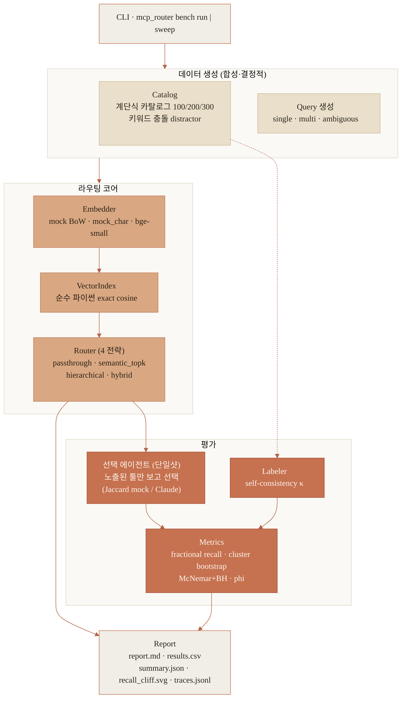
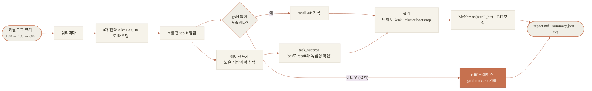

# MCP 툴 라우팅 recall 벤치마크

> **한 줄 요약.** 같은 주장을 세 번 스스로 깎아낸 기록이다. ① 약한 렉시컬 유사도(mock)에선
> 툴이 늘수록 semantic top-k가 정답을 놓치는 절벽이 가팔랐고(recall@1 0.70→0.13) hybrid
> 라우팅이 필수처럼 보였다. ② 그런데 실제 임베딩(bge-small)으로 같은 카탈로그를 돌리니 절벽은
> 훨씬 완만했고(0.89→0.70) hybrid 이점도 marginal이었다. ③ 나아가 실제 MCP 서버 22곳의 툴 247개를
> 재보니 근접 중복은 분명 실재하지만(70%가 코사인 0.80+ 이웃 보유) 내 합성 카탈로그가 실제보다
> 과하게 붐볐다(최근접 중앙값, 크기 맞춘 비교로 0.94 vs 0.84). 최종 입장은 "문제는 진짜지만 내가 처음에 과장했다"
> — 자극적인 숫자 하나가 아니라, 어느 상황에서 라우팅이 실제로 중요한지를 재는 도구다.

에이전트가 쓰는 MCP 툴이 수백 개로 불어나면, 그중 semantic top-k만 노출하는 라우팅이
정작 필요한 툴을 조용히 떨어뜨리는가? 그리고 그걸 막으려고 hybrid(벡터+렉시컬) 라우터까지
정말 필요한가?

이 저장소는 그 질문을 합성 카탈로그로 재현한 다음, **실제 임베딩 모델로 자기 답을 검증한다.**

결론부터 말하면 이렇다.

- 토큰 중첩만 보는 약한 유사도(bag-of-words mock)에서는 절벽이 가파르다. 카탈로그가
  100→300으로 커지는 동안 recall@1이 **0.70 → 0.13**까지 무너지고, hybrid 라우팅이 필수처럼 보인다.
- 그런데 **같은 카탈로그·같은 쿼리**를 실제 dense 임베딩(`bge-small-en-v1.5`)으로 돌리면 절벽이
  훨씬 완만하다. recall@1이 **0.89 → 0.70**로만 내려가고, hybrid의 이점도 k=3 기준 0.90 → 0.93로
  거의 사라진다.

즉 가파른 절벽은 대체로 *약한 렉시컬 유사도*의 성질이지, 카탈로그가 크다고 반드시 생기는 게
아니다. 실제 모델을 돌려보니 처음의 자극적인 헤드라인이 **부분적으로 뒤집혔다.** 이 벤치의
목적은 겁주는 숫자 하나를 파는 게 아니라, 지금 내가 어느 쪽 상황에 있는지를 데이터로 알려주는
것이다.

> 상태: **M3(오프라인 평가) + M1(돌아가는 게이트웨이).** M3 mock 경로는 순수 stdlib이고 같은
> seed면 바이트 단위로 재현된다. `bge-small` 수치는 모델을 실제로 돌려서(`--embed local`) 얻었고
> float 수준에서 재현된다. M1 게이트웨이(federation·RBAC·circuit breaker, `make gateway-demo`)는
> M3가 오프라인으로 평가하던 서빙 계층을 실제로 구현한다 — 기본 업스트림은 하베스트한 실제 툴
> 정의로 만든 in-process mock이지만, **공식 MCP SDK로 실제 stdio/HTTP 업스트림에 연결하고 게이트웨이를
> 실제 MCP 서버로 서빙하는 경로가 붙어 있고 실 서브프로세스 왕복으로 검증된다**(`pip install .[mcp]`).

---

## 결과: mock(BoW) vs 실제(bge-small)

**절벽 — semantic_topk 의 fractional recall@1, 카탈로그 크기별:**

| 카탈로그 | mock BoW | bge-small (실제) |
|---|---|---|
| 100 | 0.70 | 0.89 |
| 200 | 0.28 | 0.78 |
| 300 | **0.13** | **0.70** |
| 100→300 낙폭 | **−0.58** | **−0.19** |

**카탈로그 300에서 전략별 recall@k:**

| 전략 | mock r@1 / r@3 | **bge r@1 / r@3** | tokens@3 |
|---|---|---|---|
| passthrough (전부 노출) | 1.00 / 1.00 | 1.00 / 1.00 | ~31,000 |
| semantic_topk | 0.13 / 0.62 | **0.70 / 0.90** | ~316 |
| hierarchical | 0.52 / 0.70 | 0.71 / 0.91 | ~316 |
| hybrid | 0.45 / 0.92 | 0.70 / **0.93** | ~316 |

읽는 사람이 믿어도 되는 지점만 추리면:

- 방향은 두 경우 다 맞다. 카탈로그가 커지면 recall이 떨어지고, hybrid는 큰 k에서 여전히 도움이
  된다(bge 기준 recall@5 0.92→0.97, recall@10 0.96→1.00).
- 낙폭의 크기와 "hybrid가 꼭 필요한가"는 실제 임베딩에서 훨씬 작다. 이 코퍼스에선 semantic
  top-k도 k≥3이면 이미 ~0.90이다.
- 전부 노출하면 토큰이 약 100배 든다(k=3에서 ~31k vs ~316). 그 대가로 얻는 recall은 괜찮은
  임베딩을 k=3~5로 쓰면 거의 따라잡힌다. "hybrid 마법"이 아니라 이 **토큰/recall 트레이드오프**가
  오래 남는 발견이다.


`docs/`에 증거를 커밋해 뒀다 — `recall_cliff.svg`(mock), `recall_cliff_bge.svg`(실제), 그리고
전체 리포트/CSV. 직접 재현하려면 `make bench`(mock), `make bench-real`(bge-small,
`pip install .[local]` 필요).

---

## 시스템 구조



## 벤치 프로세스



---

## 절벽이 왜 생기고, 어디까지 믿을 수 있나

- **계단식 카탈로그**: `catalog(100) ⊂ catalog(200) ⊂ catalog(300)`. gold 툴은 어느 크기에서나
  그대로 있고, 근접 중복 distractor 풀만 커진다.
- distractor는 쿼리의 토큰을 그대로 샘플링해서 만든다(`synth.py`). 그래서 렉시컬 유사도에서는
  이들이 gold를 작은 top-k 밖으로 밀어낸다. dense 임베딩은 토큰 중첩 너머의 의미를 잡기 때문에
  이 효과에 강한데, bge 실행이 정확히 그걸 보여준다.
- **강건성 점검**(mock 절벽이 상수 하나의 산물이 아님을 확인): `make sweep`으로 `core_share`를
  6→10까지 흔들어도 낙폭이 −0.32~−0.57로 유지되고, char-trigram 임베더(`--embed mock_char`)에서도
  나타난다. 다만 이건 **일반화 증명이 아니다.** 진짜 외부 검증은 bge 실행이고, 그 답은 "mock이
  말하는 것보다 완만하다"였다.

### 실제 MCP 툴은 정말 근접 중복이 있나 (외적 타당성)
공개 MCP 서버 **22곳**(filesystem·github·gitlab·slack·git·memory·postgres·sqlite·mongodb·
google-maps·brave-search·puppeteer·playwright·firecrawl·tavily·fetch·time·gdrive·sentry·
everart·aws-kb·sequentialthinking)에서 **실제 툴 정의 247개**를 하베스트해 bge-small로 pairwise
유사도를 쟀다(`make similarity`, [`docs/real-tool-similarity.md`](docs/real-tool-similarity.md)).

- 실제 툴의 **70%**가 코사인 0.80 이상인 근접 이웃을 가진다(중앙값 최근접 0.84). 근접 중복은
  합성이 지어낸 게 아니라 실재한다 — `aggregate`/`aggregate-db`(0.96), `maps_geocode`/`maps_reverse_geocode`(0.95),
  `list_directory`/`list_directory_with_sizes`(0.93), `browser_mouse_drag_xy`/`browser_mouse_move_xy`(0.94)
  같은 실제 쌍이 그 예다. 중복은 서버 안에 몰려 있고(서버 내 0.64 vs 서버 간 0.51), github↔gitlab이나
  firecrawl↔tavily처럼 **서로 다른 서버끼리도** 겹친다.
- 다만 **합성 카탈로그가 실제보다 과하게 붐빈다**(크기 맞춘 비교): 최근접 코사인 중앙값이 합성
  0.94 vs 실제 0.84, 0.90 초과 비율이 합성 84% vs 실제 13%. 즉 합성은 절벽을 실제보다 세게 잡는다.
  (다만 이 격차는 방향성 지표다 — 합성 NN은 crowding knob의 출력값이자 템플릿형 embed_text로 bge
  코사인이 인위 상승하므로, 두 열이 엄밀히 대등하진 않다. `docs/real-tool-similarity.md` 참고.)
- 그래서 정직한 종합: **문제(근접 중복)는 실재하지만, 실제 코퍼스+실제 임베딩에서는 절벽이
  이 저장소의 mock 수치보다도 더 완만할 가능성이 높다.** (표본 247개/22서버는 앵커일 뿐 모집단
  추정이 아니다.)

### 라우팅 전략이 실제로 중요해지는 때
hybrid·hierarchical은 유사도 신호가 약하거나, 툴들이 렉시컬로 거의 판박이거나, k가 아주 작을
때 값을 한다. 임베딩이 좋고 카탈로그가 적당하면 semantic top-k를 k≥3으로 쓰는 걸로 충분한 경우가
많다. 이 하네스는 그중 어느 경우인지를 내 데이터 위에서 숫자로 재보라고 있는 것이다.

## 무엇이 실제고 무엇이 mock인가

| 항목 | 오프라인 기본 (mock 수치) | 실제 경로 (여기 bge 수치) |
|---|---|---|
| 임베딩 | hashed bag-of-words / char-trigram | **bge-small-en-v1.5 (실행함)** |
| 에이전트 / task_success | 일부러 약하게 만든 Jaccard mock | Claude tool-use (`.[claude]`, 미실행) |
| 벡터 인덱스 | 순수 파이썬 exact cosine | 동일 (pgvector는 일부러 안 만듦) |

- **task_success는 약한 보조 지표다.** 정답 개수를 알려주지 않은 약한 Jaccard 에이전트가 노출
  집합에서 고른다. recall과 얼마나 독립인지 보라고 **phi(recall_hit, task_success) ≈ 0.29**(mock 기본)을 같이
  적어 둔다(낮으면 recall을 이름만 바꾼 게 아니라는 뜻). 절대값 자체는 낮게 설계돼 있고 순서만
  의미가 있다. 유의성 검정(McNemar, BH 보정)은 task_success가 아니라 **recall_hit** 위에서 돌린다.
- **사람이 붙인 라벨은 없다.** 라벨 리포트는 자동 라벨러가 합성 정답을 얼마나 되찾는지의
  self-consistency(κ ≈ 0.40, mock 기본 / bge 실행 시 ≈0.42)일 뿐, 사람 검증 라벨 품질이 아니다.
- 토큰 비용은 JSON 스키마 chars/4 **휴리스틱**이다. ~100배 비율(3-of-N)은 상수에 강건하지만 절대
  토큰 수는 아니다.

### 일부러 안 만든 것 (스코프 규율)
pgvector/HNSW(수백 개 벡터엔 exact brute-force가 더 빠르고 정확), docker-compose, 별도 LangGraph
에이전트(Claude 어댑터가 이미 tool-use를 함), OpenTelemetry 익스포터(단일 프로세스 벤치엔 JSONL로
충분), latency 파이프라인(부하 없는 in-process 계측은 의미 없음). 안 쓸 걸 만들어 두는 대신 뺐다.

## 게이트웨이 (M1, 돌아가는 서빙 계층)

M3가 오프라인으로 평가하던 것을 실제로 돌린다. 세 가지가 핵심이다.

- **Federation** — 여러 업스트림 MCP 서버의 툴을 `server.tool`로 네임스페이싱해 하나의 카탈로그로
  통합한다(서버명은 유일 가정 — 중복 시 에러; 서버 내 툴명 충돌은 suffix로 가드 + 네임→업스트림 역해석).
  기본 업스트림은 하베스트한 실제 툴 정의(22서버)로
  만든 in-process mock이라 네트워크 없이 결정적으로 돈다.
- **RBAC** — 테넌트별 allow/deny(글롭, deny 우선)로 노출 카탈로그를 먼저 거른다. 예: `ci`는
  github/gitlab/filesystem/git만, `readonly`는 읽기 동사(get/list/read/search…) allowlist라 그 외는 기본 거부.
  매칭은 `fnmatchcase`(대소문자 구분)라 플랫폼 무관하게 같은 판정을 준다.
- **Circuit breaker** — 업스트림별 closed→open→half-open. 실패가 임계를 넘으면 트립해 즉시 fast-fail,
  쿨다운 뒤 half-open 프로브로 복구. 클록을 주입해 결정적으로 테스트된다.

노출 툴 선정은 **M3의 라우터를 그대로 재사용**한다(쿼리 힌트가 있으면 top-k로 컨텍스트 예산). 서빙과
벤치가 같은 라우팅 코드를 공유하는 셈이다.

```bash
make gateway-demo    # 인프로세스 walk-through: federation -> RBAC -> routing -> breaker 트립/복구
make gateway-serve   # stdlib JSON-RPC HTTP 서버 (tools/list · tools/call · gateway/stats; X-Tenant 헤더)
```

**실제 MCP 연결(공식 SDK, `pip install .[mcp]`).** mock/stdlib를 진짜로 교체한다.
- 업스트림: `deploy/gateway.mcp.config.json`처럼 `upstreams`에 stdio(예: `npx @modelcontextprotocol/server-everything`)
  또는 http(streamable) 서버를 지정하면, async SDK 세션을 전용 이벤트루프 스레드로 브리지해 동기 Gateway에
  붙인다(`gateway/mcp_upstream.py`). 세션은 주기적 `send_ping` 헬스 프로브로 감시하고, 사망 시 지수 백오프로
  자동 재연결하며 상태를 `gateway/stats`의 `upstream_health`로 노출한다.
- 서빙: `make gateway-serve TRANSPORT=... ` 대신 `python -m mcp_router gateway serve --transport mcp-stdio`로
  게이트웨이를 **공식 MCP 서버**(lowlevel Server, stdio)로 노출한다(`gateway/mcp_server.py`).
- 검증: 실제 FastMCP 서버 서브프로세스와의 stdio 왕복 + 게이트웨이를 MCP 서버로 띄워 SDK 클라이언트로
  호출하는 **양방향 통합 테스트**(`tests/test_mcp_integration.py`, `.[mcp]` 없으면 자동 skip).

## 실행

```bash
make bench      # 오프라인·순수 stdlib·같은 seed면 바이트 단위 재현
make test       # unittest 41케이스 (절벽·에이전트·게이트웨이·재연결·실제 MCP 왕복; .[mcp] 없으면 MCP 통합만 skip)
make sweep      # core_share 민감도
make bench-real # bge-small 임베딩 (pip install .[local]); float 재현
```

## 방법론 메모
primary는 fractional recall@k, secondary는 hit-rate. 난이도(single/multi/ambiguous)별로 나눠 본다.
CI는 **gold-cluster bootstrap**이다(쿼리 180개가 gold 툴 30개 위에 뭉쳐 있어서 iid 부트스트랩은
CI를 과소추정한다). McNemar는 recall_hit 위에서 돌리고 Benjamini-Hochberg로 다중비교를 보정한다
(hierarchical vs hybrid는 mock에서 양방향이다 — k=1에서 b=34/c=21, p=0.11이라 유의차 없음; bge에선 이 대비가 사라진다). 모든 knob은
`summary.json`에 박힌다.

## 로드맵
~~실제 MCP 서버 코퍼스로 pairwise 유사도 측정~~ → 완료(`make similarity`).
~~돌아가는 게이트웨이(federation·RBAC·서킷브레이커)~~ → M1 완료(`make gateway-demo`, `src/mcp_router/gateway/`).
~~실제 stdio/HTTP MCP 업스트림 + 공식 MCP SDK 트랜스포트 연결~~ → 완료(`gateway/mcp_upstream.py`·`mcp_server.py`, `.[mcp]`, 양방향 통합 테스트).
~~MCP 업스트림 세션 재연결/헬스체크~~ → 완료(`send_ping` 헬스 프로브 + 지수 백오프 재연결, `gateway/stats`에 `upstream_health`; 재연결 상태머신은 SDK 없이 fake로 결정적 테스트).
남은 것: streamable-HTTP 멀티테넌트 서버, cassette를 커밋한 Claude
tool-use 에이전트 실행, 토큰 비용용 실제 토크나이저, 더 넓은 서버 표본.

## 구조
```
src/mcp_router/
  catalog/     계단식 카탈로그(키워드 충돌 distractor) + 쿼리 생성 + Spec
  routing/     4개 전략 + RoutingContext
  providers/   임베딩(mock / mock_char / bge-small) + llm(mock jaccard / claude)
  vectorstore/ 순수 파이썬 exact cosine 인덱스
  labeling/    self-consistency 라벨러 + Cohen's kappa
  bench/       분리된 에이전트, metrics(fractional recall·cluster bootstrap·McNemar+BH·phi),
               runner, report
  gateway/     M1 서빙: federation · rbac · breaker · server(Gateway) · factory
               transport(stdlib HTTP JSON-RPC) · mcp_upstream(SDK stdio/http client) · mcp_server(SDK stdio)
  tracing.py · cli.py (bench run|sweep · gateway serve|demo)
tests/         unittest 21케이스
```
