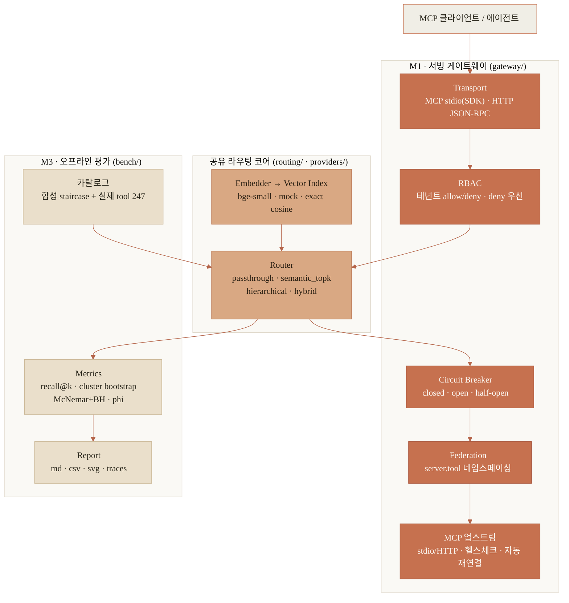
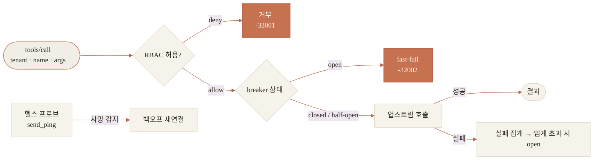

# mcp-router

수백 개 MCP tool을 다루는 AX 에이전트 백엔드에서 **tool routing·context budgeting·서빙 신뢰성**을
end-to-end로 다룬 프로젝트. 오프라인 벤치(M3)로 라우팅 전략을 계측하고, 같은 라우팅 코어를 실제
게이트웨이(M1)로 서빙한다. 순수 stdlib로 결정적으로 돌아가며(오프라인 기본), 실제 임베딩·Claude·
MCP SDK는 opt-in 어댑터다.

> **한 줄 요약.** 강한 주장을 세우고 실측으로 스스로 반증했다. ① 약한 렉시컬 유사도(mock)에선
> semantic top-k가 tool을 놓치는 recall cliff가 가팔랐다(recall@1 0.70→0.13). ② 실제 임베딩
> (bge-small)에선 훨씬 완만했다(0.89→0.70), hybrid 이점도 marginal. ③ 실제 MCP 서버 22곳의 tool
> 247개를 재보니 근접 중복은 실재하나(70%가 코사인 0.80+ 이웃) 합성이 실제보다 과하게 붐볐다
> (중앙값 0.94 vs 0.84). 결론: 문제는 진짜지만 초기 헤드라인은 과장 — 어느 상황에서 라우팅이
> 실제로 중요한지를 재는 도구다.

---

## 실무에서 마주친 깊은 문제와 해결

| 문제 (production) | 핵심 고민 | 해결 |
|---|---|---|
| **Tool sprawl / context budgeting** — tool이 수백 개면 스키마가 컨텍스트를 잠식하고 top-k가 정답 tool을 누락 | 토큰을 아끼면서 recall을 지키는 지점은? | 4개 라우팅 전략을 `recall@k`로 계측, hybrid(벡터+렉시컬)로 recall 회복. "전량 노출 대비 3-of-N 토큰"의 트레이드오프를 수치화 |
| **벤치 외적 타당성** — 합성 데이터가 문제를 과장하지 않았나 | mock 결론이 실제로도 성립하나 | 실제 임베딩(bge-small)·실제 tool 코퍼스(22서버/247)로 자기 검증 → 초기 주장 하향 보정 |
| **가짜 엄밀성** — 약한 신호 위 통계 남발 | 지표가 라우팅 품질을 실제로 구분하나 | fractional recall@k, **gold-cluster bootstrap**(클러스터 의존성), McNemar+Benjamini-Hochberg, `phi`로 task_success↔recall **탈-폐회로** 입증 |
| **서빙 신뢰성** — 업스트림 장애 전파·권한·중복 | 한 서버 장애가 전체를 멈추지 않게 | per-upstream **circuit breaker**(closed/open/half-open, 스레드 안전·단일 프로브), **RBAC**(테넌트 allow/deny·deny 우선·`fnmatchcase`로 결정적), **federation**(server.tool 네임스페이싱) |
| **async↔sync 통합** — 비동기 MCP SDK를 동기 게이트웨이에 | 세션을 안전하게 오래 유지 | 업스트림별 전용 event-loop 스레드 브리지 + `send_ping` **헬스체크·지수 백오프 자동 재연결** |
| **미인증 캐시 증식(DoS)** — `X-Tenant` 원문 키잉 | 공격자 제어 입력이 메모리를 무한 점유 | 캐시 키를 **유효 정책 아이덴티티**로 축약 + 상한 |
| **결정성/재현성** | 같은 seed면 같은 결과인가 | 순수 stdlib·주입 clock·seed 봉투 → 벤치 수치 바이트 단위 재현 |
| **과설계 회피** | 안 쓸 인프라를 넣지 않기 | pgvector/OTel/latency 파이프라인 절단, 실제 어댑터는 `.[extra]` opt-in |

각 항목은 **적대적 리뷰(총 7회)로 검증**했다 — 라우팅 폐회로, breaker 썬더링 허드, readonly RBAC 우회,
캐시 DoS, MCP 세션 누수 등 실제 결함을 매번 잡아 고쳤다.

---

## 시스템 아키텍처



## 게이트웨이 요청 흐름 (`tools/call`)



---

## 핵심 결과: mock(BoW) vs 실제(bge-small)

카탈로그 300 · semantic_topk의 fractional recall@1 낙폭, 그리고 전략별 recall@k:

| | mock r@1 (100→300) | bge r@1 (100→300) | 300에서 recall@3 (mock / bge) |
|---|---|---|---|
| semantic_topk | 0.70 → **0.13** | 0.89 → **0.70** | 0.62 / 0.90 |
| hybrid | — | — | **0.92 / 0.93** |
| passthrough | 1.00 (tokens ~31k) | 1.00 | 1.00 / 1.00 |

- 방향은 둘 다 성립(카탈로그↑ → recall↓, hybrid는 큰 k에서 도움). **크기는 실제 임베딩에서 훨씬 작다.**
- 전량 노출은 토큰 ~100배(≈31k vs ≈316@k=3). 괜찮은 임베딩 + k≥3이면 그 recall을 거의 따라잡는다.


증거는 `docs/`에 커밋(mock/bge 차트, 리포트/CSV, 실제 tool 유사도 분석). `make bench` / `make bench-real` /
`make similarity`로 재현.

---

## 실행

```bash
make bench          # 오프라인·순수 stdlib·같은 seed면 바이트 단위 재현
make test           # 41 unittest (cliff·에이전트·게이트웨이·재연결·실제 MCP 왕복)
make gateway-demo   # 게이트웨이 walk-through: federation → RBAC → routing → breaker 트립/복구
make bench-real     # bge-small 실제 임베딩 (pip install .[local])
make similarity     # 실제 MCP tool 코퍼스 pairwise 유사도

# 실제 MCP 연결 (pip install .[mcp])
python -m mcp_router gateway serve --transport mcp-stdio         # 게이트웨이를 MCP 서버로 서빙
python -m mcp_router gateway serve --config deploy/gateway.mcp.config.json   # 실제 stdio/HTTP 업스트림
```

## 무엇이 실제고 무엇이 mock인가
- **실행 검증**: bge-small 임베딩, 실제 MCP SDK 양방향 stdio 왕복(업스트림 연결 + 게이트웨이 서빙),
  실제 tool 코퍼스 유사도.
- **mock(기본)**: hashed BoW/char-trigram 임베딩, Jaccard 선택 에이전트, in-process 업스트림.
- **미실행(로드맵)**: Claude tool-use 에이전트(cassette), 실제 토크나이저 토큰 계측.
- `task_success`는 약한 보조 지표(정답 개수 미고지) — `phi≈0.29`로 recall과 독립임을 명시. 라벨 리포트는
  사람 검증이 아닌 self-consistency(`κ≈0.40`).

## 구조
```
src/mcp_router/
  catalog/     합성 staircase(키워드 충돌 distractor) + 쿼리 생성 + Spec
  routing/     4 전략 + RoutingContext            providers/  임베딩(mock/mock_char/bge) + llm(mock/claude)
  vectorstore/ exact cosine index                labeling/   self-consistency 라벨러 + kappa
  bench/       선택 에이전트 · metrics · runner · report
  gateway/     federation · rbac · breaker · server · transport(HTTP)
               mcp_upstream(SDK client·재연결) · mcp_server(SDK stdio) · factory
tests/         41 unittest (.[mcp] 없으면 실제-MCP만 skip)
```

## 로드맵
streamable-HTTP 멀티테넌트 서버, cassette 커밋한 Claude 에이전트 실행, 실제 토크나이저 토큰 계측,
더 넓은 tool 표본.
