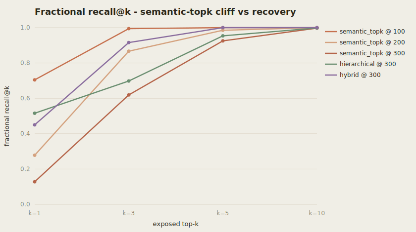

# MCP Gateway — tool-routing benchmark

A benchmark harness that answers one question with reproducible data:

> When an agent's MCP tool catalog grows to hundreds of tools, **does exposing
> only a semantic top-k of them silently drop the right tool — and does that
> cause the agent to fail the task?**

Short answer, measured here: **yes, badly** — and a hybrid (vector + lexical)
router recovers almost all of the lost recall **at ~1% of the token cost** of
exposing everything.

> Status: **M3 (the benchmark)**. This is the "heart" milestone of a larger MCP
> Gateway project — the part that turns *"tool sprawl hurts"* from a claim into a
> chart. The gateway serving path is a documented roadmap item below.

---

## TL;DR results (seed=1234, 180 labeled queries, catalog staircase 100→200→300)

**The recall cliff.** `semantic_topk` recall@1 as the distractor pool grows:

| catalog size | semantic_topk recall@1 | 95% CI (bootstrap) |
|---|---|---|
| 100 | **0.556** | 0.483–0.628 |
| 200 | **0.222** | 0.161–0.289 |
| 300 | **0.167** | 0.117–0.228 |

**Recovery at catalog=300** (recall@k, and task success of a ReAct agent that
sees *only* the exposed tools):

| strategy | recall@1 | recall@3 | recall@5 | task-success@3 | tokens@3 (p95) |
|---|---|---|---|---|---|
| passthrough (expose all) | 1.00 | 1.00 | 1.00 | 0.87 | **25,800** |
| semantic_topk | 0.17 | 0.60 | 0.84 | 0.53 | 258 |
| hierarchical (top-2 groups) | 0.52 | 0.66 | 0.86 | 0.64 | 258 |
| **hybrid (vector+lexical)** | **0.77** | **0.93** | **0.98** | **0.87** | **258** |

**Headline:** hybrid reaches the *same task success as exposing every tool
(0.87) while sending ~1% of the tokens* (258 vs 25,800). McNemar on paired
per-query task success (size 300, k=3): hybrid beats semantic_topk on **60**
queries and loses on **0** (χ²≈58, p<1e-5) — a statistically significant win,
not noise.

**Label quality:** the query→gold labels are auto-generated then checked against
a 50-query human-verified subset. **Cohen's κ = 0.89** (high, but < 1 — ambiguous
queries genuinely fool auto-labeling), reported so you can trust the ground truth.



> Chart + a full sample run are committed under [`docs/`](docs/) (`sample-report.md`,
> `sample-results.csv`); regenerate everything yourself with `make bench`.

---

## Why this is a real experiment, not a scripted demo

The cliff is a **property of the geometry**, reproduced from first principles:

- The catalog is a **nested staircase**: `catalog(100) ⊂ catalog(200) ⊂ catalog(300)`.
  The same gold tools exist at every size; only the near-duplicate distractor
  pool grows.
- A query shares 8 tokens + a rare keyword with its gold tool (overlap 9). Each
  distractor shares `Xd ~ Uniform{4..12}` tokens and **no keyword**; under pure
  semantic similarity a distractor out-ranks gold iff it shares ≥10. Distractors
  are round-robin assigned to the queried tools, so each gold accrues ~1
  distractor at N=100 and ~8 at N=300 → the chance that ≥k of them out-rank gold
  rises → gold falls out of the exposed top-k → **recall collapses.**
- The keyword is rare (query + only gold). Lexical/BM25 matching pins it, which
  is exactly why the **hybrid** strategy recovers the recall semantic-topk loses.
- **A recall miss becomes a task failure**: the ReAct agent only ever sees the
  exposed tools. If routing dropped the gold tool, the agent literally cannot
  select it. That causal chain is recorded per query in `artifacts/traces.jsonl`.

### When NOT to use semantic top-k (the honest part)

Small k is a **token optimization that trades away recall**, and the trade is
catastrophic exactly when the catalog is large and full of look-alike tools —
which is when you reach for a gateway in the first place. If your tools are few
or well-separated, plain top-k is fine. If they are many and near-duplicate,
top-k drops the right tool and *no amount of prompt tuning downstream fixes a
tool that was never exposed.* Use hybrid (or raise k and pay the tokens). This
harness exists to tell you **which regime you're in, with numbers.**

---

## Quickstart (zero dependencies, offline, deterministic)

The default path is **pure Python standard library** — no API keys, no network,
no `pip install`. Same seed → byte-identical `recall@k`, task success, CIs, and
κ across machines (only wall-clock latency varies, and it's labeled as a measured
indicator, not a reproducible metric).

```bash
make bench          # == PYTHONPATH=src python -m mcp_router bench run --out artifacts
make test           # 14 unittest cases incl. the load-bearing cliff assertions
```

Artifacts land in `artifacts/`: `report.md`, `results.csv`, `summary.json`,
`recall_cliff.svg`, and `traces.jsonl` (every routing decision + the gold tool's
rank, so you can open the exact query where top-k dropped it).

---

## Architecture

```
query ─▶ RoutingContext(catalog embedded into a VectorIndex + group vectors)
          │
          ├─ passthrough      expose all              (recall ceiling / token floor)
          ├─ semantic_topk    global vector top-k     (loses recall as catalog grows)
          ├─ hierarchical     top-2 groups → top-k    (filters cross-group distractors)
          └─ hybrid           vector + lexical kw     (recovers recall the keyword pins)
                              │
                              ▼
          ReAct agent sees ONLY the exposed tools ─▶ task success
                              │
          Tracer records candidate/exposed/gold-rank per query ─▶ traces.jsonl
```

Everything is behind an interface with an offline default and an opt-in
production adapter:

| concern | offline default (stdlib) | production adapter (opt-in) |
|---|---|---|
| embeddings | hashed bag-of-words | `bge-small-en-v1.5` (`.[local]`) |
| LLM / agent | deterministic mock ReAct | Claude tool-use + LangGraph (`.[claude]`,`.[agent]`) |
| vector index | pure-Python cosine | pgvector HNSW in Postgres (`.[pg]`) |
| tracing | JSONL span log | OpenTelemetry / OTLP (`.[otel]`) |

Production models (when you switch adapters in): benchmark runner
`claude-sonnet-5`, cheap labeling `claude-haiku-4-5-20251001`. Real LLM calls are
VCR-cached to keep runs deterministic and cheap.

```bash
docker compose up -d postgres      # pgvector
make bench-real                    # --embed local --llm claude --vector pgvector
```

---

## Reproducibility envelope

Every run stamps `git_sha`, `seed`, `embed_model`, `llm_model_id`,
`vector_backend`, and the full config into `summary.json` and every `bench_run`.
CIs are seeded bootstrap (1000 resamples); strategy comparisons use McNemar.
A CI job can gate merges on `recall@k`/`task_success` regressions (roadmap).

## Roadmap (deliberately cut from M3 to stay solo-shippable)

- Gateway **serving** path (this M3 is the offline evaluation half): live MCP
  server/client federation, YAML config, tenant RBAC, circuit breakers.
- Real MCP server harvesting (filesystem/github/slack/postgres/brave-search)
  alongside the synthetic staircase.
- CI recall-regression gate; Grafana eval dashboard from OTel; Terraform (ECS).
- GraphRAG / knowledge-graph routing as a 5th strategy.

## Layout

```
src/mcp_router/
  catalog/     synthetic staircase catalog + query generation
  routing/     the four strategies + RoutingContext
  providers/   embedding + LLM (mock default; claude/local opt-in)
  vectorstore/ cosine index (memory default; pgvector opt-in)
  labeling/    LLM labeler + Cohen's kappa
  bench/       ReAct agent, metrics (recall/success/bootstrap/McNemar), runner, report
  tracing.py   span recorder (JSONL; OTel opt-in)
  cli.py       `python -m mcp_router bench run`
tests/         unittest (cliff must be real; hybrid must recover)
```
